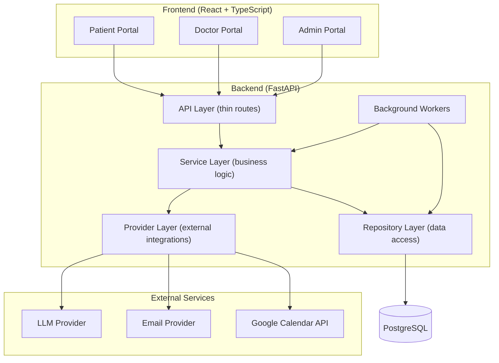
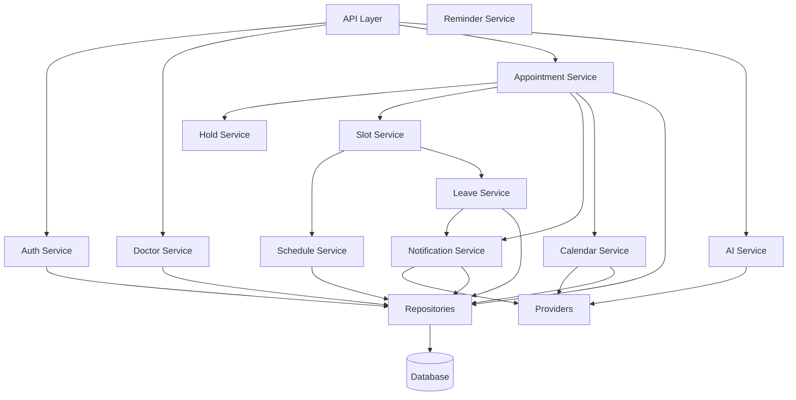
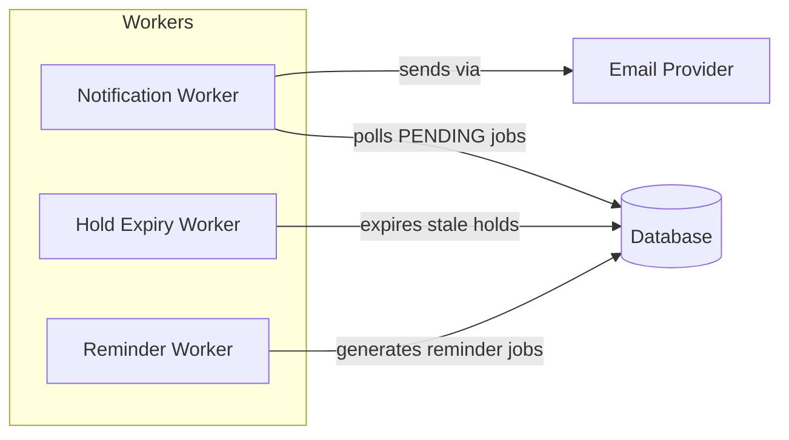
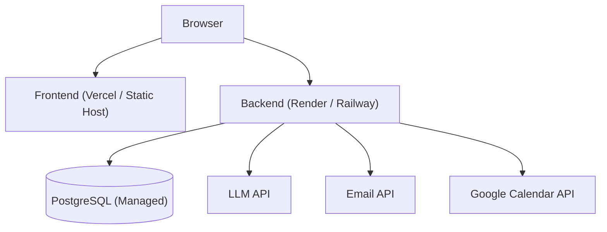

# System Architecture

## Overview

The Healthcare Appointment & Follow-up Manager is a **modular monolith** with a React + TypeScript frontend and a Python + FastAPI backend, backed by PostgreSQL.

The system provides three role-based portals (Patient, Doctor, Admin) for managing appointments, AI-assisted clinical summaries, email notifications, and Google Calendar integration.

---

## Technology Stack

| Layer | Technology |
|-------|-----------|
| Frontend | React + TypeScript |
| Backend | Python + FastAPI |
| Database | PostgreSQL |
| ORM | SQLAlchemy |
| Migrations | Alembic |
| Validation | Pydantic |
| Authentication | JWT (JSON Web Tokens) |
| Testing | pytest |
| Background Processing | Simple Python worker/scheduler |

---

## High-Level Architecture



---

## Backend Module Structure

> This reflects the actual tree as of Phase 13 (verified by listing the repo, not the
> Phase 0 plan — some module boundaries shifted during implementation, e.g. AI/notes
> models consolidated into `models/clinical.py`, and `hold_repository.py`/
> `clinical_repository.py`/`calendar_repository.py` were added as their subsystems landed).

```
backend/
├── app/
│   ├── main.py                # FastAPI application factory, middleware, startup
│   ├── config.py               # Pydantic Settings (env vars)
│   ├── database.py             # SQLAlchemy engine, session factory
│   ├── dependencies.py         # get_db, get_current_user, require_role, ownership checks
│   ├── exceptions.py           # AppException hierarchy + handlers
│   ├── logging_config.py
│   ├── core/
│   │   ├── security.py         # password hashing, JWT encode/decode
│   │   └── datetime_utils.py   # ensure_utc helper
│   └── api/                    # thin route handlers, one file per resource
│       ├── health.py
│       ├── auth.py             # register, login, me
│       ├── doctors.py          # search, profile, schedule, leaves, slots (public/patient)
│       ├── admin.py            # doctor CRUD, working hours, leave creation (admin)
│       ├── slots.py            # slot holds
│       ├── appointments.py     # booking, reschedule, cancel, list/get
│       └── ai.py                # symptom report, consultation, pre/post-visit AI summaries
├── models/                     # SQLAlchemy ORM (one file per domain area, not one-per-table)
│   ├── user.py                 # User
│   ├── doctor.py               # Doctor, DoctorWorkingHours, DoctorLeave
│   ├── appointment.py          # Appointment, AppointmentHold
│   ├── clinical.py             # SymptomReport, AISummary, Consultation, Prescription, Medication
│   ├── notification.py         # NotificationJob
│   └── calendar.py             # CalendarEvent
├── schemas/                    # Pydantic request/response contracts
│   ├── auth.py
│   ├── doctor.py
│   ├── slot.py
│   ├── appointment.py
│   └── ai.py                   # covers symptom report, consultation, and AI summary schemas
├── repositories/                # persistence, one per aggregate
│   ├── user_repository.py
│   ├── doctor_repository.py
│   ├── hold_repository.py
│   ├── appointment_repository.py
│   ├── clinical_repository.py  # symptom reports, consultations, prescriptions, medications
│   ├── notification_repository.py
│   └── calendar_repository.py
├── services/                    # business rules
│   ├── auth_service.py
│   ├── doctor_service.py
│   ├── schedule_service.py
│   ├── leave_service.py         # read/delete only — see doctor_leave_service.py for creation
│   ├── doctor_leave_service.py  # leave creation + conflict detection (Phase 8)
│   ├── slot_service.py
│   ├── hold_service.py
│   ├── appointment_service.py   # booking/reschedule/cancel lifecycle + post-commit hooks
│   ├── ai_service.py
│   ├── notification_service.py
│   ├── reminder_service.py      # appointment + medication reminder scheduling
│   └── calendar_service.py
├── providers/                    # external-service abstractions, each with Real + Mock
│   ├── ai_provider.py
│   ├── email_provider.py
│   └── calendar_provider.py
├── workers/                      # simple polling workers, no broker
│   ├── notification_worker.py
│   └── calendar_worker.py
├── alembic/
│   ├── env.py
│   └── versions/                 # 4 migrations: initial_schema, create_domain_models,
│                                  # add_double_booking_unique_constraint, add_calendar_sync_retry_fields
└── tests/                        # 104 tests total (see docs/requirement-mapping.md)
    ├── conftest.py
    ├── test_config.py, test_database.py, test_health.py       # Phase 1
    ├── test_models.py                                          # Phase 2 (+ Phase 6 hardening)
    ├── test_auth.py                                             # Phase 3
    ├── test_doctors.py                                          # Phase 4
    ├── test_slots.py                                            # Phase 5
    ├── test_appointments.py, test_concurrency.py               # Phase 6
    ├── test_ai.py                                               # Phase 7
    ├── test_leave_conflicts.py                                 # Phase 8
    ├── test_notifications.py                                   # Phase 9
    ├── test_calendar.py                                        # Phase 10
    └── test_e2e.py                                              # Phase 12
```

---

## Frontend Structure

> Actual tree (Phase 11). Deliberately no state-management or UI library — see
> `docs/engineering-decisions.md`.

```
frontend/
├── src/
│   ├── api/
│   │   ├── client.ts           # fetch wrapper: auth header, error normalisation (ApiError)
│   │   └── types.ts            # TypeScript types mirroring the backend Pydantic schemas
│   ├── auth/
│   │   ├── AuthContext.tsx     # session state, login/logout, restores session from token
│   │   └── ProtectedRoute.tsx  # role-based route guard (navigation convenience only —
│   │                           #   the backend remains the sole authorization authority)
│   ├── components/
│   │   ├── Layout.tsx          # topbar + role-based nav
│   │   └── ui.tsx              # Spinner, ErrorBanner, Card, Field, ConfirmDialog, etc.
│   ├── lib/
│   │   ├── format.ts           # UTC-safe date formatting, parseServerDate()
│   │   └── useAsync.ts         # loading/error/reload hook used by every data-driven page
│   ├── pages/
│   │   ├── Login.tsx, Register.tsx
│   │   ├── patient/            # dashboard, doctor search, booking flow, appointment list/detail
│   │   ├── doctor/              # dashboard, appointment list, consultation detail
│   │   └── admin/                # dashboard, doctor management/config, conflicted appointments
│   ├── App.tsx                  # route table
│   ├── main.tsx                 # entrypoint
│   ├── styles.css
│   └── vite-env.d.ts
├── index.html
├── vite.config.ts               # dev proxy of /api to the backend
├── package.json
└── tsconfig.json
```

---

## Module Boundaries

Each module has clear responsibilities and dependencies flow downward:



**Key boundary rules:**
- API routes call services only — no direct DB access from routes
- Services contain business logic — no HTTP-specific concerns
- Repositories handle persistence — no business rules
- Providers wrap external APIs — no appointment state changes
- Workers call services — same boundary rules apply

---

## Provider Abstractions

All external services are accessed through provider interfaces. Each has a real implementation and a mock for DEMO_MODE.

### AI Provider

```
AIProvider (abstract)
├── RealAIProvider     # Calls actual LLM API (e.g., OpenAI, Gemini)
└── MockAIProvider     # Returns deterministic structured responses
```

- Input: symptom text or clinical notes
- Output: structured Pydantic-validated response
- Failure: returns error status — appointment remains valid

### Email Provider

```
EmailProvider (abstract)
├── RealEmailProvider  # Sends via SendGrid/Mailgun/similar
└── MockEmailProvider  # Logs email to console/file
```

- Input: recipient, subject, body, template
- Output: success/failure
- Failure: notification job marked for retry

### Calendar Provider

```
CalendarProvider (abstract)
├── GoogleCalendarProvider  # Google Calendar API via OAuth 2.0
└── MockCalendarProvider    # Logs operations, returns mock event IDs
```

- Operations: create, update, delete
- Failure: calendar event marked for retry — appointment remains valid

---

## Background Job Architecture

Background processing uses a simple Python scheduler/worker model (no Celery, no Redis, no Kafka).



**Worker responsibilities:**
| Worker | Schedule | Action |
|--------|----------|--------|
| Notification Worker | Polls every 30s | Picks up PENDING notification jobs, sends via email provider, updates status |
| Hold Expiry Worker | Polls every 60s | Finds holds past `expires_at`, marks as inactive, releases slots |
| Reminder Worker | Polls every 5 min | Checks prescriptions for upcoming medication times, creates notification jobs |

Workers are run as background threads or a separate process alongside the FastAPI app.

---

## Authentication & RBAC Model

### Roles
- **PATIENT** — register, login, book appointments, view own data
- **DOCTOR** — login, view assigned appointments, submit consultations
- **ADMIN** — login, manage doctors, schedules, leaves, view conflicts

### Authentication Flow
1. Patient registers via `/api/auth/register`
2. User logs in via `/api/auth/login` → receives JWT
3. JWT included in `Authorization: Bearer <token>` header
4. Backend validates JWT on every protected request

### Authorization Enforcement
- **Route-level:** dependency injection checks role (`require_role(ADMIN)`)
- **Resource-level:** ownership checks (patient can only see own appointments)
- JWT contains: `user_id`, `role`, `exp`
- Passwords hashed with bcrypt — never stored in plaintext
- Secrets loaded from environment variables — never hardcoded

---

## DEMO_MODE Strategy

When `DEMO_MODE=true` in environment:
- `MockAIProvider` replaces `RealAIProvider`
- `MockEmailProvider` replaces `RealEmailProvider`
- `MockCalendarProvider` replaces `GoogleCalendarProvider`

The application remains fully functional with deterministic, predictable responses. No external API keys required.

Provider selection is handled in `dependencies.py` based on `config.DEMO_MODE`.

---

## Deployment Architecture



| Component | Hosting | Notes |
|-----------|---------|-------|
| Frontend | Vercel or similar | Static React build |
| Backend | Render / Railway | FastAPI with Uvicorn |
| Database | Managed PostgreSQL | Render / Railway / Supabase |
| Workers | Same process as backend | Background threads/scheduler |

Environment variables manage all configuration. `.env.example` documents required variables.
