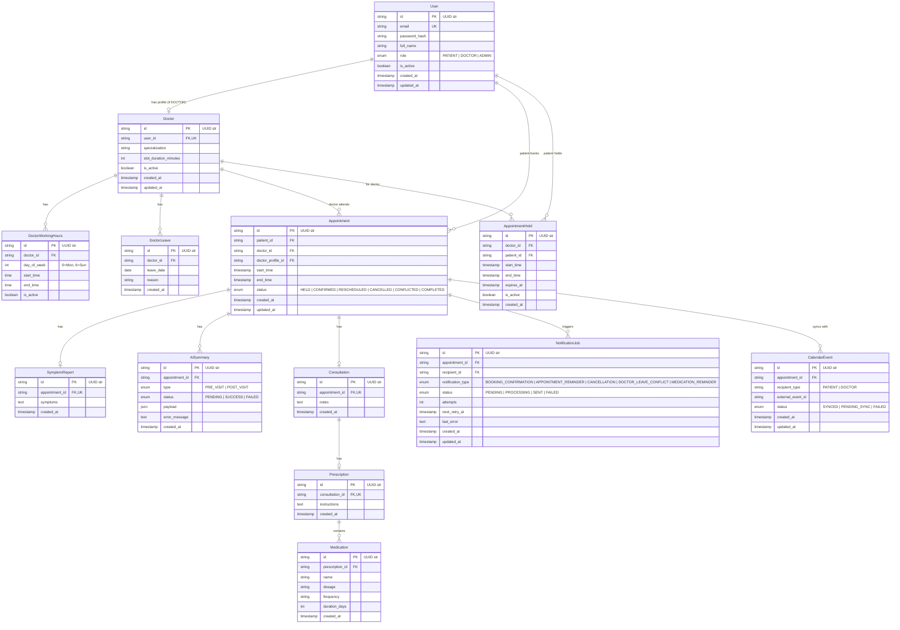
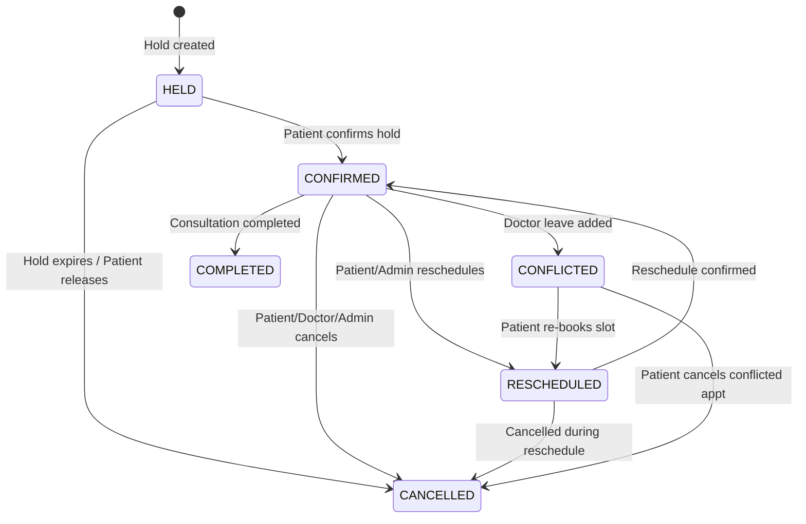
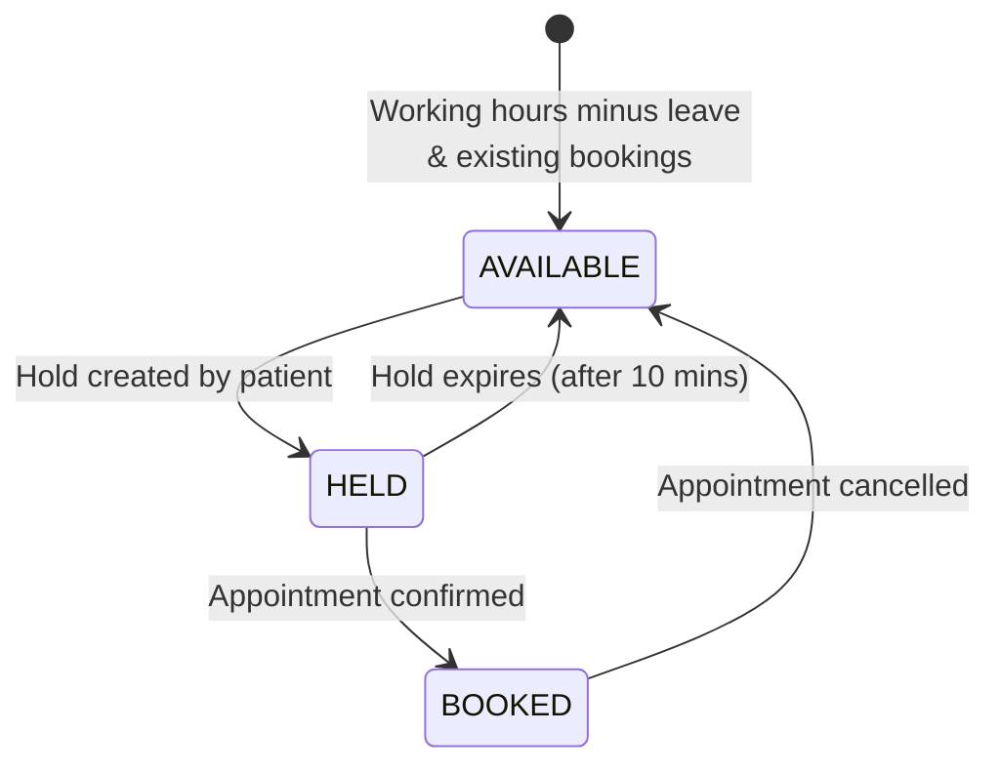
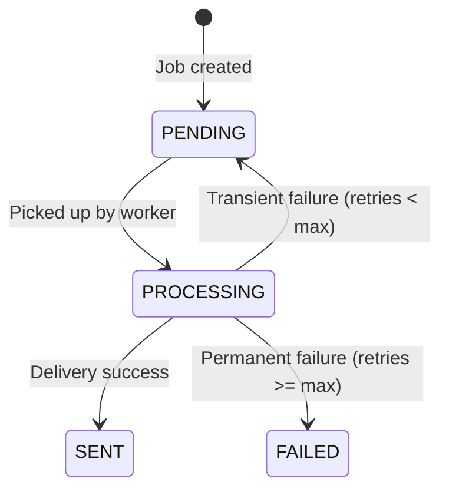

# Database Design

## Overview

The database uses PostgreSQL with SQLAlchemy ORM and Alembic migrations.
The relational design enforces data integrity, appointment state consistency, and double-booking prevention.
All tables are created from zero via Alembic migrations.

---

## Entity Relationship Diagram




---

## State Machines

### 1. Appointment State Machine



**State Definitions:**
- **HELD**: Slot temporarily reserved for patient (temporary state before confirmation)
- **CONFIRMED**: Booking finalized and active
- **RESCHEDULED**: Moved to a new time slot
- **CANCELLED**: Booking terminated; slot released
- **CONFLICTED**: Doctor leave overlaps this booking; requires patient action
- **COMPLETED**: Consultation finished by doctor

### 2. Slot State Machine



**State Definitions:**
- **AVAILABLE**: Slot exists in working hours, no active hold, no booking, no leave
- **HELD**: Temporarily held by a patient (blocks other holds/bookings)
- **BOOKED**: Occupied by a CONFIRMED appointment

### 3. Notification Job State Machine



**State Definitions:**
- **PENDING**: Scheduled for delivery
- **PROCESSING**: In-flight by notification worker
- **SENT**: Successfully delivered via provider
- **FAILED**: Permanent failure after maximum retry attempts (e.g. 3 attempts)

---

## Constraints & Integrity Rules

### Double-Booking Prevention
1. **Database Exclusion Constraint / Index:**
   A partial unique index on `(doctor_id, start_time)` for active appointments:
   ```sql
   CREATE UNIQUE INDEX idx_unique_doctor_active_slot 
   ON appointments (doctor_id, start_time) 
   WHERE status IN ('HELD', 'CONFIRMED');
   ```
2. **Explicit Row Locking:**
   When booking or holding, the transaction acquires a `SELECT ... FOR UPDATE` on the target doctor's working schedule or existing appointments to evaluate conflicts atomically.

### Doctor Leave Constraint
- Doctor leave dates prevent slot generation for the full 24-hour day of the leave date.
- Leave creation executes in a transaction that queries overlapping `CONFIRMED` appointments, updates their status to `CONFLICTED`, and enqueues `NotificationJob` records for affected patients.
