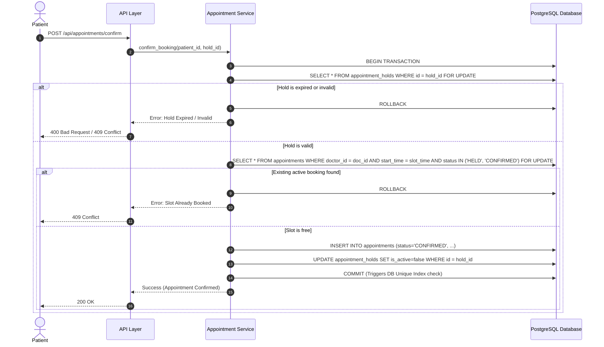
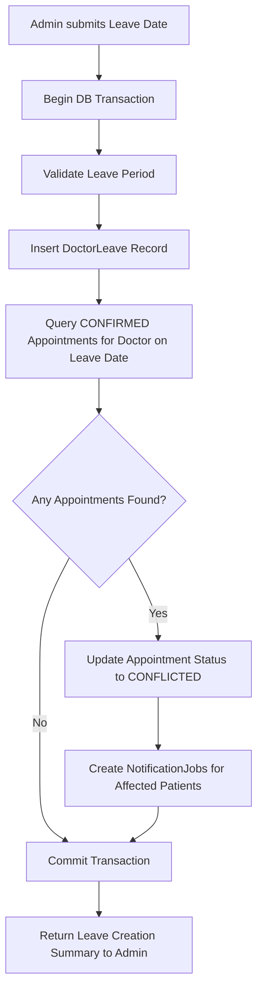
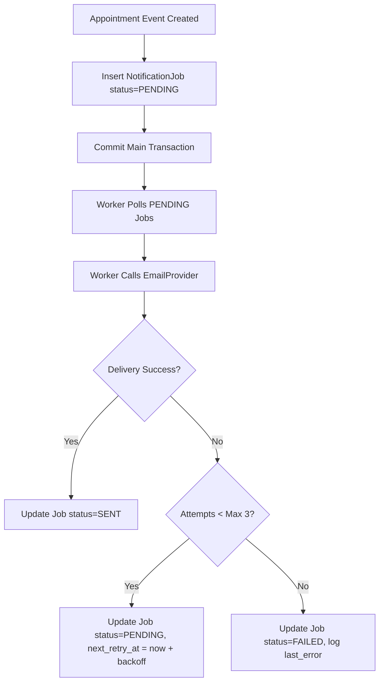

# System Design

This document details the core reliability mechanisms of the Healthcare Appointment & Follow-up Manager.

---

## 1. Double-Booking Prevention Strategy

Preventing double-booking requires a multi-layered defence where the database is the final authority.

### Key Controls:
1. **Row-Level Locking:** `FOR UPDATE` lock prevents concurrent transactions from reading stale slot states.
2. **Database Constraint:** Partial unique index `idx_unique_doctor_active_slot` acts as the final guard against race conditions.

---

## 2. Doctor Leave Conflict Workflow

When an admin marks a doctor as on leave for a specific date:

### Key Controls:
- **Atomicity:** Leave creation and appointment status conversion to `CONFLICTED` occur within the same database transaction.
- **Data Preservation:** Appointments are marked `CONFLICTED`, preserving historical details for rescheduling without data loss.

---

## 3. Slot Hold Mechanism

To prevent race conditions while a patient fills out symptom forms:

1. **Hold Request:** Patient selects a slot; `HoldService` creates an `AppointmentHold` record with `expires_at = now() + 10 minutes`.
2. **Hold Exclusions:** Slot generation logic ignores slots with active, non-expired holds.
3. **Automatic Expiry:** Background `HoldExpiryWorker` periodically deactivates expired holds.
4. **Confirmation Guard:** Attempting to confirm an expired hold rejects the transaction and forces slot re-selection.

---

## 4. Notification Failure Handling & Retries

Notifications must never break appointment creation or state transitions.

### Key Controls:
- **Decoupled Delivery:** Email provider calls happen asynchronously via workers.
- **Exponential Backoff:** Retries are delayed (e.g., 1 min, 5 min, 15 min).
- **Idempotency:** Jobs are locked during processing (`PROCESSING` state) to prevent duplicate delivery by parallel worker loops.
